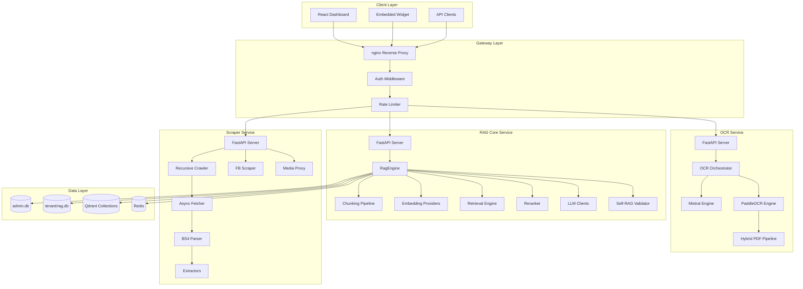
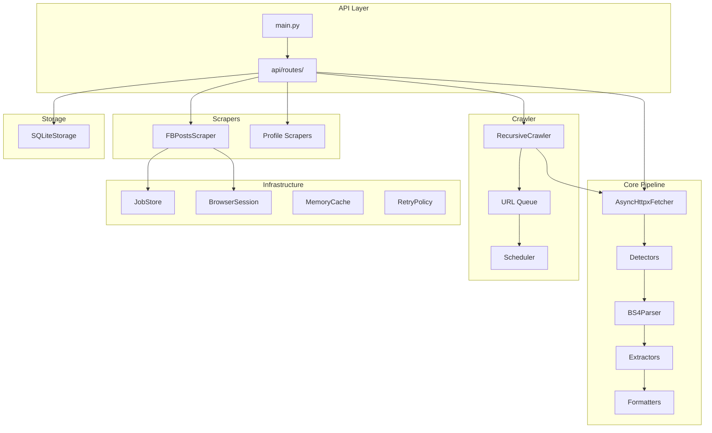
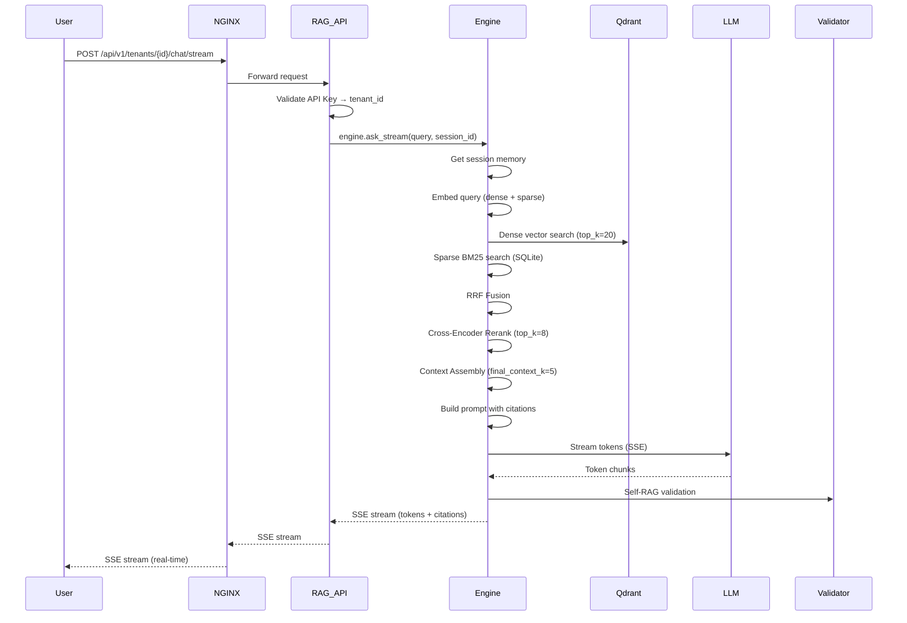
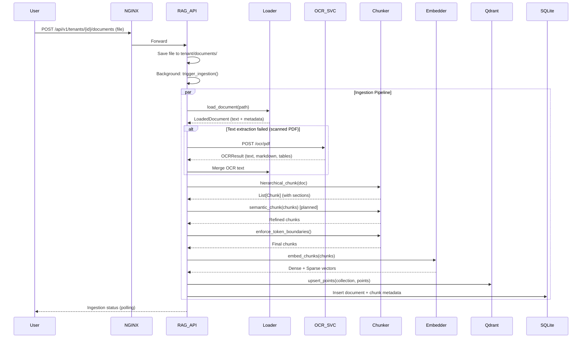
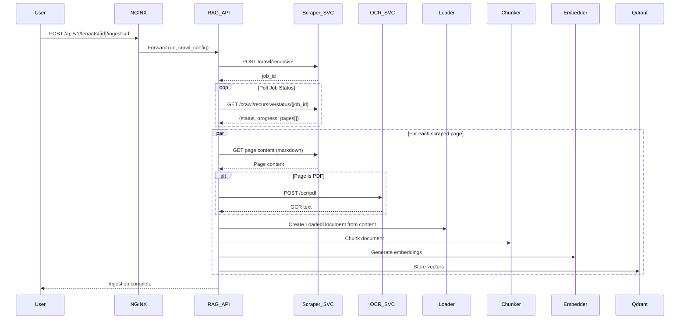
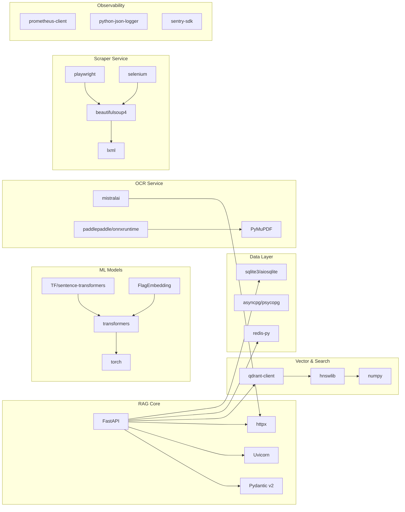

# TenBit RAG Platform — Architecture Documentation

> **Version:** 1.0 | **Last Updated:** 2025 | **Status:** Production-Ready Design

---

## Table of Contents

1. [System Overview](#1-system-overview)
2. [High-Level Architecture](#2-high-level-architecture)
3. [Service Architecture](#3-service-architecture)
4. [Data Flow Diagrams](#4-data-flow-diagrams)
5. [Database Design](#5-database-design)
6. [API Design](#6-api-design)
7. [Security Architecture](#7-security-architecture)
8. [Deployment Architecture](#8-deployment-architecture)
9. [Scalability & Performance](#9-scalability--performance)
10. [Technology Stack](#10-technology-stack)

---

## 1. System Overview

The TenBit RAG Platform is an enterprise-grade, multi-tenant Retrieval-Augmented Generation system that combines:

- **RAG Core**: Multi-tenant document ingestion, hybrid search, and LLM-powered Q&A
- **OCR Service**: Intelligent document processing with cloud + local fallback
- **Scraper Service**: Web content extraction with recursive crawling capabilities

### 1.1 Design Principles

| Principle | Implementation |
|-----------|----------------|
| **Multi-Tenancy First** | Complete isolation at DB, vector, and API level |
| **Microservices** | Independent services communicating via HTTP/REST |
| **Pluggable Architecture** | Strategy pattern for engines (OCR, Embeddings, Rerankers) |
| **Graceful Degradation** | Fallback chains for all external dependencies |
| **Observability** | Structured logging, health checks, metrics |
| **Security by Default** | Encryption, rate limiting, input validation |

### 1.2 Target Architecture (Production)

```
┌─────────────────────────────────────────────────────────────────────────────────┐
│                            TENANT REQUEST                                        │
│                    (X-API-Key: rbs_rag_sk_tenantA_xxx)                          │
└─────────────────────────────────────┬───────────────────────────────────────────┘
                                      │
                                      ▼
┌─────────────────────────────────────────────────────────────────────────────────┐
│                              API GATEWAY (nginx)                                 │
│                    Rate Limiting │ TLS Termination │ Routing                    │
└─────────────────────────────────────┬───────────────────────────────────────────┘
                                      │
          ┌───────────────────────────┼───────────────────────────┐
          ▼                           ▼                           ▼
┌─────────────────────┐   ┌─────────────────────┐   ┌─────────────────────┐
│      RAG API        │   │    OCR Service      │   │  Scraper Service    │
│     (Port 8100)     │   │    (Port 8001)      │   │    (Port 8002)      │
│                     │   │                     │   │                     │
│ • Tenant Resolution │   │ • Mistral OCR (Primary    │   │ • Recursive Crawl  │
│ • Auth & Rate Limit │   │ • Paddle Fallback   │   │ • FB Scraper       │
│ • Chat/Stream       │   │ • Hybrid PDF        │   │ • Media Proxy      │
│ • Ingestion Mgmt    │   │ • Batch Processing  │   │ • Profile Scraper  │
└──────────┬──────────┘   └─────────────────────┘   └─────────────────────┘
           │
           ▼
┌─────────────────────────────────────────────────────────────────────────────────┐
│                              DATA LAYER                                          │
├─────────────────────┬─────────────────────┬─────────────────────────────────────┤
│      SQLite         │       Qdrant        │             Redis                    │
│   (Per-Tenant)      │   (Per-Tenant)      │           (Shared)                   │
│                     │                     │                                       │
│ • Admin DB          │ • Vector Collections│ • Session Cache                      │
│ • Tenant Config     │ • Chunk Embeddings  │ • Rate Limit Counters                │
│ • Session Memory    │ • Metadata Payload  │ • Job Queues                         │
│ • User Memory       │ • HNSW Indexes      │ • Distributed Locks                  │
│ • Document Registry │ • Hybrid Search     │                                       │
└─────────────────────┴─────────────────────┴─────────────────────────────────────┘
```

---

## 2. High-Level Architecture

### 2.1 Component Diagram



### 2.2 Service Communication Matrix

| From Service | To Service | Protocol | Purpose |
|--------------|------------|----------|---------|
| RAG Core | OCR Service | HTTP/REST | Document OCR fallback |
| RAG Core | Scraper Service | HTTP/REST | URL content ingestion |
| RAG Core | Qdrant | gRPC/HTTP | Vector search & storage |
| RAG Core | SQLite | Local | Relational data |
| RAG Core | Redis | Redis Protocol | Caching, rate limiting |
| All Services | Admin DB | Local | Tenant resolution |
| nginx | All Services | HTTP/REST | Reverse proxy |

---

## 3. Service Architecture

### 3.1 RAG Core Service (`src/rbs_rag/`)

#### 3.1.1 Module Structure

```
src/rbs_rag/
├── __init__.py           # Package exports
├── __main__.py           # CLI entry point
├── config.py             # Configuration management (Pydantic Settings)
├── models.py             # Core Pydantic models
├── engine.py             # RagEngine - main orchestration
├── document_loaders.py   # Document parsing + OCR integration
├── chunking.py           # Hierarchical + Semantic chunking
├── embeddings.py         # Embedding providers (Hash, OpenAI, Gemini, BGE-M3)
├── retrieval.py          # Hybrid search (Dense + Sparse + RRF)
├── reranking.py          # Rerankers (Heuristic, BGE Cross-Encoder)
├── store.py              # SQLite storage abstraction
├── vector_store.py       # Qdrant abstraction (planned)
├── llm.py                # LLM providers (Gemini, OpenAI, Anthropic)
├── validation.py         # Self-RAG validation
├── text.py               # Text processing utilities
├── cloud_sync.py         # Google Drive/OneDrive sync
├── cli.py                # CLI command handlers
└── web/
    ├── server.py         # FastAPI server + all endpoints
    ├── admin_db.py       # Multi-tenant admin database
    ├── static/
    │   ├── index.html    # React SPA dashboard
    │   └── widget.html   # Embeddable chat widget
    └── web_run.py        # Web server entry point
```

#### 3.1.2 Core Classes

**RagEngine** (`engine.py`)
```python
class RagEngine:
    """Main orchestration class for RAG operations."""
    
    def __init__(self, config: AppConfig, root: Path):
        self.config = config
        self.store = RagStore(config.storage)
        self.embedding_provider = get_embedding_provider(config.embeddings)
        self.retriever = HybridRetriever(self.store, config.retrieval)
        self.reranker = get_reranker(config.reranker)
        self.llm_client = get_llm_client(config.llm)
        self.validator = SelfRAGValidator()
    
    def ingest_path(self, path: Path, kb_id: str, ...)
    def ingest_file(self, file: UploadFile, kb_id: str, ...)
    def search(self, query: str, kb_id: str, filters: dict, ...)
    def ask(self, query: str, session_id: str, user_id: str, ...)
    def ask_stream(self, query: str, session_id: str, user_id: str, ...)  # SSE
```

**HybridRetriever** (`retrieval.py`)
```python
class HybridRetriever:
    """Combines dense vector search + sparse BM25 + RRF fusion."""
    
    def retrieve(self, query: str, tenant_id: str, kb_id: str, 
                 filters: dict, top_k: int) -> List[Chunk]:
        # 1. Embed query (dense + sparse)
        # 2. Dense search via Qdrant
        # 3. Sparse search via BM25 (SQLite)
        # 4. Reciprocal Rank Fusion
        # 5. Return top-K
```

#### 3.1.3 Ingestion Pipeline

```
Document Upload
       │
       ▼
┌──────────────────┐
│ Document Loader  │  (document_loaders.py)
│ • Text/MD/HTML   │
│ • DOCX           │
│ • PDF (native)   │
└────────┬─────────┘
         │
         ▼ (if native text < threshold)
┌──────────────────┐
│ OCR Service      │  (HTTP → ocr-service-main:8001)
│ • Mistral Primary│
│ • Paddle Fallback│
└────────┬─────────┘
         │
         ▼
┌──────────────────┐
│ Metadata         │
│ Enrichment       │
└────────┬─────────┘
         │
         ▼
┌──────────────────┐
│ Hierarchical     │  (chunking.py)
│ Chunker          │
│ • H1-H6 parsing  │
│ • Section tree   │
└────────┬─────────┘
         │
         ▼
┌──────────────────┐
│ Semantic         │  (planned)
│ Chunker          │
│ • Paragraph sim  │
│ • Topic boundaries
└────────┬─────────┘
         │
         ▼
┌──────────────────┐
│ Token Boundary   │
│ Enforcement      │
│ • 320 tokens max │
│ • 48 overlap     │
└────────┬─────────┘
         │
         ▼
┌──────────────────┐
│ Embedding        │  (embeddings.py)
│ Generation       │
│ • sentence-      │
│   transformers   │
│   (BGE models)   │
│ • Hash fallback  │
└────────┬─────────┘
         │
         ▼
┌──────────────────┐
│ SQLite Storage   │  (store.py + vector_store.py)
│ • Per-tenant     │
│   rag.db        │
│ • JSON-serialized│
│   embeddings     │
│ • BM25 sparse    │
│   index          │
└──────────────────┘
```

### 3.2 OCR Service (`ocr-service-main/`)

#### 3.2.1 Architecture

```mermaid
graph TB
    subgraph "API Layer"
        MAIN[main.py]
        ROUTERS[api/routers/ocr.py]
    end
    
    subgraph "Service Layer"
        IMG_SVC[ImageOCRService]
        PDF_SVC[PDFOCRService]
        BATCH_SVC[BatchProcessor]
    end
    
    subgraph "Orchestration"
        ORCH[OCROrchestrator]
    end
    
    subgraph "Engines (Strategy Pattern)"
        MISTRAL[MistralOCREngine]
        PADDLE[PaddleOCREngine]
    end
    
    subgraph "PDF Pipeline"
        PDF_PIPE[HybridPDFPipeline]
        TEXT_EXT[TextExtractor]
        RENDERER[PageRenderer]
        IMG_EXT[ImageExtractor]
        IMG_PROC[ImageProcessor]
        DECOR_FILTER[DecorativeFilter]
    end
    
    subgraph "Post-Processing"
        TABLE[TableParser]
        JP_CORR[JapaneseCorrector]
        ENTITY[EntityExtractor]
    end
    
    MAIN --> ROUTERS
    ROUTERS --> IMG_SVC
    ROUTERS --> PDF_SVC
    ROUTERS --> BATCH_SVC
    IMG_SVC --> ORCH
    PDF_SVC --> ORCH
    BATCH_SVC --> IMG_SVC
    BATCH_SVC --> PDF_SVC
    ORCH --> MISTRAL
    ORCH --> PADDLE
    PADDLE --> PDF_PIPE
    PDF_PIPE --> TEXT_EXT
    PDF_PIPE --> RENDERER
    PDF_PIPE --> IMG_EXT
    PDF_PIPE --> IMG_PROC
    PDF_PIPE --> DECOR_FILTER
    ORCH --> TABLE
    ORCH --> JP_CORR
    ORCH --> ENTITY
```



#### 3.2.2 Engine Fallback Flow

```
POST /ocr/pdf
       │
       ▼
┌──────────────────┐
│ FileValidator    │  (Size, MIME, extension)
└────────┬─────────┘
         │
         ▼
┌──────────────────┐
│ OCROrchestrator  │
│ engines=[Mistral,│
│         Paddle]  │
└────────┬─────────┘
         │
         ▼
┌──────────────────┐
│ MistralOCREngine │
│ process_pdf()    │
└────────┬─────────┘
         │
    ┌────┴────┐
    │ Success │
    └────┬────┘
         │
         ▼
┌──────────────────┐
│ ResultBuilder    │
│ build_ocr_result │
└────────┬─────────┘
         │
         ▼
┌──────────────────┐
│ OCRResult JSON   │
└──────────────────┘

    Failure
         │
         ▼
┌──────────────────┐
│ PaddleOCREngine  │
│ process_pdf()    │
│                  │
│ HybridPDFPipeline│
│ • Native text    │
│ • Render + OCR   │
└────────┬─────────┘
         │
         ▼ (same ResultBuilder)
```

### 3.3 Scraper Service (`scraper-service-main/`)

#### 3.3.1 Architecture



#### 3.3.2 Crawl Pipeline

```
POST /crawl/recursive
       │
       ▼
┌──────────────────┐
│ Validate Request │
│ URL, depth, pages│
└────────┬─────────┘
         │
         ▼
┌──────────────────┐
│ JobStore.create()│  → Returns job_id
└────────┬─────────┘
         │
         ▼ (Background Thread)
┌──────────────────┐
│ RecursiveCrawler │
│                  │
│ 1. Seed URL → Queue│
│ 2. While queue &  │
│    pages < max:   │
│    a. Dequeue URL │
│    b. Fetch       │
│    c. Detect      │
│    d. Parse       │
│    e. Extract     │
│    f. Format      │
│    g. Store       │
│    h. Enqueue links│
│    i. Update job  │
└────────┬─────────┘
         │
         ▼
┌──────────────────┐
│ Job Status: Done │
└──────────────────┘
```

---

## 4. Data Flow Diagrams

### 4.1 Chat Query Flow (RAG Core)



### 4.2 Document Ingestion Flow



### 4.3 URL Ingestion Flow (Scraper Integration)



---

## 5. Database Design

### 5.1 SQLite Schema (Admin Database)

```sql
-- admin.db
-- Global multi-tenant configuration

CREATE TABLE tenants (
    tenant_id TEXT PRIMARY KEY,
    name TEXT NOT NULL,
    status TEXT DEFAULT 'active',           -- 'active', 'suspended'
    subscription_tier TEXT DEFAULT 'basic', -- 'basic', 'premium', 'enterprise'
    monthly_fee REAL DEFAULT 299.00,
    created_at TEXT DEFAULT (datetime('now')),
    updated_at TEXT DEFAULT (datetime('now')),
    
    -- LLM Configuration
    llm_provider TEXT DEFAULT 'gemini',
    llm_model TEXT DEFAULT 'gemini-2.5-flash-lite',
    llm_api_key TEXT NOT NULL,              -- ENCRYPTED in production
    llm_base_url TEXT,
    
    -- Embedding Configuration
    embedding_provider TEXT DEFAULT 'hash',
    embedding_model TEXT DEFAULT 'BAAI/bge-small-en-v1.5',
    embedding_dimensions INTEGER DEFAULT 384,
    embedding_base_url TEXT,
    embedding_api_key TEXT,
    
    -- Retrieval Configuration
    retrieval_top_k INTEGER DEFAULT 20,
    retrieval_rerank_top_k INTEGER DEFAULT 8,
    retrieval_final_context_k INTEGER DEFAULT 5,
    retrieval_dense_weight REAL DEFAULT 0.55,
    retrieval_sparse_weight REAL DEFAULT 0.45,
    
    -- Chunking Configuration
    chunking_max_tokens INTEGER DEFAULT 320,
    chunking_overlap_tokens INTEGER DEFAULT 48,
    
    -- Session Configuration
    session_memory_limit INTEGER DEFAULT 8,
    chat_retention_days INTEGER DEFAULT 30
);

CREATE TABLE api_keys (
    key_id TEXT PRIMARY KEY,                -- rbs_rag_sk_...
    tenant_id TEXT NOT NULL REFERENCES tenants(tenant_id),
    key_hash TEXT NOT NULL,                 -- bcrypt hash
    name TEXT,
    created_at TEXT DEFAULT (datetime('now')),
    last_used_at TEXT,
    expires_at TEXT,
    is_active INTEGER DEFAULT 1
);

CREATE TABLE activity_logs (
    id INTEGER PRIMARY KEY AUTOINCREMENT,
    tenant_id TEXT REFERENCES tenants(tenant_id),
    level TEXT NOT NULL,                    -- 'info', 'warning', 'error'
    event_type TEXT NOT NULL,               -- 'ingestion', 'chat', 'admin', etc.
    message TEXT NOT NULL,
    metadata TEXT,                          -- JSON
    created_at TEXT DEFAULT (datetime('now'))
);

CREATE INDEX idx_activity_logs_tenant ON activity_logs(tenant_id);
CREATE INDEX idx_activity_logs_created ON activity_logs(created_at);
CREATE INDEX idx_api_keys_tenant ON api_keys(tenant_id);
```

### 5.2 SQLite Schema (Per-Tenant Database)

```sql
-- tenants/{tenant_id}/rag.db
-- Isolated per-tenant data

-- Knowledge Bases
CREATE TABLE knowledge_bases (
    kb_id TEXT PRIMARY KEY,
    name TEXT NOT NULL,
    description TEXT,
    created_at TEXT DEFAULT (datetime('now')),
    updated_at TEXT DEFAULT (datetime('now'))
);

-- Documents
CREATE TABLE documents (
    document_id TEXT PRIMARY KEY,
    kb_id TEXT NOT NULL REFERENCES knowledge_bases(kb_id),
    name TEXT NOT NULL,
    document_type TEXT NOT NULL,            -- 'pdf', 'docx', 'md', 'html', 'url'
    source_path TEXT,                       -- Local path or source URL
    file_size INTEGER,
    page_count INTEGER,
    mime_type TEXT,
    
    -- Metadata (enriched)
    author TEXT,
    department TEXT,
    country TEXT,
    region TEXT,
    language TEXT,
    version TEXT,
    creation_date TEXT,
    modification_date TEXT,
    upload_date TEXT DEFAULT (datetime('now')),
    tags TEXT,                              -- JSON array
    access_level TEXT DEFAULT 'internal',   -- 'public', 'internal', 'confidential'
    
    -- Processing status
    processing_status TEXT DEFAULT 'pending', -- 'pending', 'processing', 'completed', 'failed'
    processing_error TEXT,
    chunk_count INTEGER DEFAULT 0,
    created_at TEXT DEFAULT (datetime('now')),
    updated_at TEXT DEFAULT (datetime('now'))
);

CREATE INDEX idx_documents_kb ON documents(kb_id);
CREATE INDEX idx_documents_status ON documents(processing_status);

-- Chunks
CREATE TABLE chunks (
    chunk_id TEXT PRIMARY KEY,
    document_id TEXT NOT NULL REFERENCES documents(document_id) ON DELETE CASCADE,
    kb_id TEXT NOT NULL REFERENCES knowledge_bases(kb_id),
    text TEXT NOT NULL,
    token_count INTEGER,
    
    -- Hierarchical position
    section_path TEXT,                      -- "1.2.3" or "Chapter 1 / Section 2"
    heading TEXT,
    heading_level INTEGER,                  -- 1-6 for H1-H6
    page_number INTEGER,
    chunk_index INTEGER,                    -- Order within document
    
    -- Embeddings (JSON serialized for SQLite fallback)
    embedding_dense TEXT,                   -- JSON array [0.1, -0.2, ...]
    embedding_sparse TEXT,                  -- JSON sparse vector
    
    -- Metadata
    metadata TEXT,                          -- JSON
    created_at TEXT DEFAULT (datetime('now'))
);

CREATE INDEX idx_chunks_document ON chunks(document_id);
CREATE INDEX idx_chunks_kb ON chunks(kb_id);

-- Chat Sessions
CREATE TABLE sessions (
    session_id TEXT PRIMARY KEY,
    user_id TEXT NOT NULL,
    kb_id TEXT REFERENCES knowledge_bases(kb_id),
    turn_count INTEGER DEFAULT 0,
    created_at TEXT DEFAULT (datetime('now')),
    last_turn_at TEXT DEFAULT (datetime('now'))
);

CREATE INDEX idx_sessions_user ON sessions(user_id);

-- Session Turns
CREATE TABLE session_turns (
    id INTEGER PRIMARY KEY AUTOINCREMENT,
    session_id TEXT NOT NULL REFERENCES sessions(session_id) ON DELETE CASCADE,
    turn_index INTEGER NOT NULL,
    role TEXT NOT NULL,                     -- 'user', 'assistant'
    content TEXT NOT NULL,
    metadata TEXT,                          -- JSON (citations, confidence, etc.)
    created_at TEXT DEFAULT (datetime('now'))
);

CREATE INDEX idx_turns_session ON session_turns(session_id);

-- User Memory
CREATE TABLE user_memory (
    id INTEGER PRIMARY KEY AUTOINCREMENT,
    user_id TEXT NOT NULL,
    key TEXT NOT NULL,
    value TEXT NOT NULL,
    created_at TEXT DEFAULT (datetime('now')),
    updated_at TEXT DEFAULT (datetime('now')),
    UNIQUE(user_id, key)
);

CREATE INDEX idx_user_memory_user ON user_memory(user_id);
```

### 5.3 Qdrant Collection Schema (Per-Tenant)

```python
# Collection name: "{tenant_id}_chunks"
# Vector config: Dense (1024 dim) + Sparse

from qdrant_client.models import (
    VectorParams, SparseVectorParams, 
    Distance, SparseIndexParams
)

collection_config = {
    "vectors": {
        "dense": VectorParams(
            size=1024,                    # BGE-M3 dense dimension
            distance=Distance.COSINE,
            on_disk=True,                 # For large collections
            quantization_config=ScalarQuantization(
                scalar=ScalarQuantizationConfig(
                    type=ScalarType.INT8,
                    quantile=0.99,
                    always_ram=True
                )
            )
        )
    },
    "sparse_vectors": {
        "sparse": SparseVectorParams(
            index=SparseIndexParams(
                on_disk=False
            )
        )
    },
    # Payload schema for filtering
    "payload_schema": {
        "tenant_id": "keyword",
        "kb_id": "keyword",
        "document_id": "keyword",
        "document_name": "text",
        "document_type": "keyword",
        "section_path": "keyword",
        "heading": "text",
        "heading_level": "integer",
        "page_number": "integer",
        "chunk_index": "integer",
        "language": "keyword",
        "department": "keyword",
        "access_level": "keyword",
        "tags": "keyword",
        "upload_date": "datetime"
    }
}
```

### 5.4 Redis Schema

```redis
# Session cache
# Key: session:{tenant_id}:{session_id}
# Value: JSON {turns: [...], memory: {...}}
# TTL: 24 hours (configurable)

# Rate limiting
# Key: ratelimit:{tenant_id}:{endpoint}:{window}
# Value: integer count
# TTL: window seconds (e.g., 60s for per-minute)

# Ingestion job status
# Key: ingestion:{tenant_id}:{job_id}
# Value: JSON {status, progress, logs[], summary}
# TTL: 1 hour

# Job queues (Scraper)
# Key: queue:crawl:{job_id}
# Value: List of URLs (LPUSH/RPOP)

# Distributed locks
# Key: lock:{resource}:{tenant_id}
# Value: owner_id
# TTL: 30 seconds (auto-release)
```

---

## 6. API Design

### 6.1 REST Conventions

| Aspect | Convention |
|--------|------------|
| **Base Path** | `/api/v1` |
| **Tenant Context** | Path parameter: `/tenants/{tenant_id}/...` |
| **Authentication** | Header: `X-API-Key: rbs_rag_sk_...` |
| **Content Type** | `application/json` (request/response) |
| **File Upload** | `multipart/form-data` |
| **Streaming** | `text/event-stream` (SSE) |
| **Errors** | RFC 7807 Problem Details |

### 6.2 Error Response Format

```json
{
  "type": "https://tenbit-rag.com/errors/validation-error",
  "title": "Validation Error",
  "status": 422,
  "detail": "Request body validation failed",
  "instance": "/api/v1/tenants/tenantA/chat",
  "errors": [
    {
      "field": "query",
      "code": "missing",
      "message": "Query is required"
    }
  ]
}
```

### 6.3 Pagination

```json
{
  "items": [...],
  "pagination": {
    "page": 1,
    "page_size": 20,
    "total_items": 150,
    "total_pages": 8
  }
}
```

### 6.4 RAG Core API Endpoints

#### Tenant Management
| Method | Endpoint | Description |
|--------|----------|-------------|
| POST | `/tenants` | Create new tenant |
| GET | `/tenants` | List all tenants (admin) |
| GET | `/tenants/{id}` | Get tenant details |
| PUT | `/tenants/{id}` | Update tenant |
| DELETE | `/tenants/{id}` | Delete tenant |
| GET | `/tenants/{id}/isolation-audit` | Run isolation check |

#### Document Management
| Method | Endpoint | Description |
|--------|----------|-------------|
| POST | `/tenants/{id}/documents` | Upload document(s) |
| GET | `/tenants/{id}/documents` | List documents (paginated) |
| GET | `/tenants/{id}/documents/{doc_id}` | Get document details |
| DELETE | `/tenants/{id}/documents/{doc_id}` | Delete document |
| POST | `/tenants/{id}/documents/{doc_id}/reprocess` | Re-process document |

#### Ingestion
| Method | Endpoint | Description |
|--------|----------|-------------|
| POST | `/tenants/{id}/ingest` | Trigger full ingestion |
| POST | `/tenants/{id}/ingest-url` | Ingest from URL(s) |
| GET | `/tenants/{id}/ingestion/status` | Get ingestion status |
| GET | `/tenants/{id}/ingestion/logs` | Get ingestion logs |

#### Chat & Search
| Method | Endpoint | Description |
|--------|----------|-------------|
| POST | `/tenants/{id}/chat` | Chat (sync, full response) |
| POST | `/tenants/{id}/chat/stream` | Chat (SSE streaming) |
| POST | `/tenants/{id}/search` | Search without LLM |
| GET | `/tenants/{id}/search/suggest` | Query suggestions |

#### Session Management
| Method | Endpoint | Description |
|--------|----------|-------------|
| GET | `/tenants/{id}/sessions` | List sessions |
| POST | `/tenants/{id}/sessions` | Create session |
| GET | `/tenants/{id}/sessions/{session_id}` | Get session |
| GET | `/tenants/{id}/sessions/{session_id}/turns` | Get turns |
| DELETE | `/tenants/{id}/sessions/{session_id}` | Delete session |
| POST | `/tenants/{id}/sessions/purge` | Purge expired |

#### User Memory
| Method | Endpoint | Description |
|--------|----------|-------------|
| GET | `/tenants/{id}/users/{user_id}/memory` | Get user memory |
| PUT | `/tenants/{id}/users/{user_id}/memory/{key}` | Set memory |
| DELETE | `/tenants/{id}/users/{user_id}/memory/{key}` | Delete memory |

#### Cloud Sync
| Method | Endpoint | Description |
|--------|----------|-------------|
| POST | `/tenants/{id}/cloud-sync` | Sync from cloud storage |
| GET | `/tenants/{id}/cloud-sync/providers` | List configured providers |

#### System & Admin
| Method | Endpoint | Description |
|--------|----------|-------------|
| GET | `/health` | Liveness probe |
| GET | `/ready` | Readiness probe |
| GET | `/metrics` | Prometheus metrics |
| GET | `/system/logs` | System activity logs |
| POST | `/system/terminal` | Execute terminal command (admin) |

### 6.5 OCR Service API Endpoints

| Method | Endpoint | Description |
|--------|----------|-------------|
| GET | `/health` | Health check + engine status |
| POST | `/ocr/image` | OCR single image |
| POST | `/ocr/pdf` | OCR single PDF |
| POST | `/ocr/batch` | Batch OCR multiple files |

### 6.6 Scraper Service API Endpoints

| Method | Endpoint | Description |
|--------|----------|-------------|
| POST | `/crawl` | Single page crawl |
| GET | `/crawl/test` | Quick test crawl |
| POST | `/crawl/recursive` | Start recursive crawl |
| GET | `/crawl/recursive/status/{job_id}` | Poll crawl progress |
| GET | `/crawl/recursive/jobs` | List all crawl jobs |
| DELETE | `/crawl/recursive/{job_id}` | Delete crawl job |
| POST | `/scrape/fb-posts` | Start FB scrape job |
| GET | `/scrape/fb-posts/status/{job_id}` | Poll FB scrape progress |
| POST | `/scrape/profile` | Scrape social profile |
| GET | `/auth/fb-status` | Check FB login status |
| POST | `/auth/fb-login` | Initiate FB browser login |
| POST | `/auth/set-cookies` | Set FB cookies |
| GET | `/auth/fb-cookies-from-profile` | Get cookies from Chrome profile |
| POST | `/auth/fb-logout` | Clear FB session |
| GET | `/proxy/media` | Stream media (CORS bypass) |
| GET | `/proxy-download` | Download with DASH merge |
| GET | `/db/sessions` | List scrape sessions |
| GET | `/db/sessions/{id}` | Get session with posts |
| DELETE | `/db/sessions/{id}` | Delete session |
| GET | `/db/posts` | Query posts (filtered, paginated) |
| DELETE | `/db/posts/{id}` | Delete post |
| GET | `/db/stats` | Storage statistics |
| GET | `/db/export/excel` | Export to Excel |

---

## 7. Security Architecture

### 7.1 Threat Model

| Threat | Likelihood | Impact | Mitigation |
|--------|------------|--------|------------|
| API Key Leakage | Medium | High | Encryption at rest, rotation, scoped keys |
| Prompt Injection | High | High | Input sanitization, output validation |
| Tenant Data Leakage | Low | Critical | Row-level isolation, separate DBs/collections |
| DoS via LLM API | Medium | High | Rate limiting, request queuing, quotas |
| Arbitrary Code Execution | Low | Critical | Terminal endpoint restricted/removed |
| Data Exfiltration | Low | High | Audit logging, access controls |

### 7.2 Security Layers

```
┌─────────────────────────────────────────────────────────────────┐
│                      DEFENSE IN DEPTH                           │
├─────────────────────────────────────────────────────────────────┤
│                                                                  │
│  LAYER 1: NETWORK                                               │
│  ├─ TLS 1.3 termination at nginx                                │
│  ├─ WAF rules (OWASP Core Rule Set)                             │
│  │ ├─ DDoS protection (Cloudflare/AWS Shield)                       │
│  └─ Private network (VPC) for inter-service comms              │
│                                                                  │
│  LAYER 2: APPLICATION                                           │
│  ├─ API Key authentication (tenant-scoped)                      │
│  ├─ JWT for admin dashboard                                     │
│  ├─ Rate limiting (per-tenant, per-endpoint)                    │
│  ├─ Input validation (Pydantic v2 on all endpoints)             │
│  ├─ CORS policy (configurable origins)                          │
│  ├─ Security headers (CSP, HSTS, X-Frame-Options)               │
│  └─ Request size limits                                         │
│                                                                  │
│  LAYER 3: DATA                                                  │
│  ├─ Tenant isolation (separate SQLite + Qdrant collections)     │
│  ├─ API key encryption at rest (AES-256-GCM)                    │
│  ├─ PII detection/redaction in logs                             │
│  └─ Automated backup encryption                                 │
│                                                                  │
│  LAYER 4: INFRASTRUCTURE                                        │
│  ├─ Non-root containers                                         │
│  ├─ Read-only root filesystem                                   │
│  ├─ Secrets management (Vault/AWS Secrets Manager)              │
│  ├─ Regular vulnerability scanning                              │
│  └─ Audit logging (all admin actions, data access)              │
│                                                                  │
└─────────────────────────────────────────────────────────────────┘
```

### 7.3 API Key Management

```python
# Key format: rbs_rag_sk_{tenant_id}_{random_suffix}
# Example: rbs_rag_sk_tenantA_a1b2c3d4e5f6

class APIKeyManager:
    PREFIX = "rbs_rag_sk_"
    
    @staticmethod
    def generate(tenant_id: str) -> tuple[str, str]:
        """Returns (raw_key, key_hash)"""
        suffix = secrets.token_urlsafe(24)
        raw_key = f"{APIKeyManager.PREFIX}{tenant_id}_{suffix}"
        key_hash = bcrypt.hashpw(raw_key.encode(), bcrypt.gensalt())
        return raw_key, key_hash.decode()
    
    @staticmethod
    def validate(raw_key: str, key_hash: str) -> bool:
        return bcrypt.checkpw(raw_key.encode(), key_hash.encode())
    
    @staticmethod
    def parse_tenant(raw_key: str) -> str | None:
        if not raw_key.startswith(APIKeyManager.PREFIX):
            return None
        parts = raw_key.split("_")
        return parts[3] if len(parts) >= 4 else None
```

### 7.4 Prompt Injection Defense

```python
class PromptInjectionDetector:
    """Detects and blocks prompt injection attempts."""
    
    INJECTION_PATTERNS = [
        r"ignore\s+(previous|above|all)\s+instructions",
        r"system\s*:\s*you\s+are\s+now",
        r"forget\s+(everything|all|previous)",
        r"new\s+(prompt|instruction|task)",
        r"act\s+as\s+(if|though)",
        r"pretend\s+to\s+be",
        r"roleplay\s+as",
        r"\\n\\n.*(system|assistant|user)\\s*:",
    ]
    
    @classmethod
    def scan(cls, text: str) -> tuple[bool, list[str]]:
        """Returns (is_safe, detected_patterns)"""
        detected = []
        for pattern in cls.INJECTION_PATTERNS:
            if re.search(pattern, text, re.IGNORECASE):
                detected.append(pattern)
        return len(detected) == 0, detected
```

---

## 8. Deployment Architecture

### 8.1 Development Environment

```
┌─────────────────────────────────────────────────────────────────┐
│                     LOCAL DEVELOPMENT                           │
├─────────────────────────────────────────────────────────────────┤
│                                                                  │
│  Terminal 1                    Terminal 2                    T3 │
│  ┌─────────────┐              ┌─────────────┐              ┌─┐ │
│  │ OCR Service │              │ Scraper Svc │              │RAG│ │
│  │ :8001       │              │ :8002       │              │:81│ │
│  │             │              │             │              │00 │ │
│  │ venv/       │              │ venv/       │              │   │ │
│  │ uvicorn     │              │ uvicorn     │              │ven│ │
│  │  --reload   │              │  --reload   │              │v/ │ │
│  └─────────────┘              └─────────────┘              │uv │ │
│                                                             │ic │ │
│  .rbs_rag/                                                  │or │ │
│  ├─ admin.db                                                │n  │ │
│  └─ tenants/                                                │   │ │
│      ├─ tenantA/                                            │   │ │
│      │   ├─ rag.db                                          │   │ │
│      │   └─ documents/                                      │   │ │
│      └─ tenantB/                                            │   │ │
│          ├─ rag.db                                          │   │ │
│          └─ documents/                                      │   │ │
│                                                             └───┘ │
│                                                                  │
└─────────────────────────────────────────────────────────────────┘
```

### 8.2 Staging Environment (Docker Compose)

```
┌─────────────────────────────────────────────────────────────────┐
│                      STAGING (Single Host)                      │
├─────────────────────────────────────────────────────────────────┤
│                                                                  │
│  docker-compose.yml                                             │
│  ┌─────────┐ ┌─────────┐ ┌─────────┐ ┌─────────┐ ┌─────────┐  │
│  │  nginx  │ │ rag-api │ │  qdrant │ │  redis  │ │ postgres│  │
│  │  :80/443│ │  :8100  │ │  :6333  │ │  :6379  │ │  :5432  │  │
│  └────┬────┘ └────┬────┘ └────┬────┘ └────┬────┘ └────┬────┘  │
│       │           │           │           │           │       │
│       └───────────┼───────────┼───────────┼───────────┘       │
│                   │           │           │                   │
│            ┌──────┴──┐ ┌─────┴──┐ ┌─────┴──┐                │
│            │ ocr-svc │ │scrpr-svc│ │ volumes│                │
│            │  :8001  │ │  :8002  │ │        │                │
│            └─────────┘ └────────┘ └────────┘                │
│                                                                  │
└─────────────────────────────────────────────────────────────────┘
```

### 8.3 Production Environment (Kubernetes)

```yaml
# kubernetes/rag-api-deployment.yaml
apiVersion: apps/v1
kind: Deployment
metadata:
  name: rag-api
  namespace: tenbit-rag
spec:
  replicas: 3
  selector:
    matchLabels:
      app: rag-api
  template:
    metadata:
      labels:
        app: rag-api
    spec:
      containers:
      - name: rag-api
        image: tenbit/rag-api:latest
        ports:
        - containerPort: 8100
        envFrom:
        - secretRef:
            name: rag-secrets
        - configMapRef:
            name: rag-config
        resources:
          requests:
            memory: "2Gi"
            cpu: "1000m"
          limits:
            memory: "4Gi"
            cpu: "2000m"
        livenessProbe:
          httpGet:
            path: /health
            port: 8100
          initialDelaySeconds: 30
          periodSeconds: 10
        readinessProbe:
          httpGet:
            path: /ready
            port: 8100
          initialDelaySeconds: 10
          periodSeconds: 5
---
# kubernetes/rag-api-hpa.yaml
apiVersion: autoscaling/v2
kind: HorizontalPodAutoscaler
metadata:
  name: rag-api-hpa
  namespace: tenbit-rag
spec:
  scaleTargetRef:
    apiVersion: apps/v1
    kind: Deployment
    name: rag-api
  minReplicas: 3
  maxReplicas: 20
  metrics:
  - type: Resource
    resource:
      name: cpu
      target:
        type: Utilization
        averageUtilization: 70
  - type: Resource
    resource:
      name: memory
      target:
        type: Utilization
        averageUtilization: 80
```

---

## 9. Scalability & Performance

### 9.1 Scaling Strategies

| Component | Horizontal Scaling | Vertical Scaling | Limits |
|-----------|-------------------|------------------|--------|
| **RAG API** | Multiple replicas behind LB | Increase CPU/RAM | Stateless, share Qdrant/Redis |
| **Qdrant** | Cluster mode (3+ nodes) | More RAM for HNSW | 1M+ vectors per node |
| **Redis** | Cluster mode (6+ nodes) | More RAM | Sub-ms latency |
| **PostgreSQL** | Read replicas | Larger instance | Connection pooling (PgBouncer) |
| **OCR Service** | Multiple replicas | GPU for PaddleOCR | Stateless, queue-based |
| **Scraper Service** | Multiple replicas | More RAM for browsers | Selenium grid for scale |

### 9.2 Performance Targets

| Metric | Target | Measurement |
|--------|--------|-------------|
| **Vector Search (p99)** | < 10ms | Qdrant HNSW @ 100K vectors |
| **Hybrid Search (p99)** | < 50ms | Dense + Sparse + RRF |
| **Reranking (p99)** | < 200ms | BGE Cross-Encoder @ 8 candidates |
| **LLM First Token (p99)** | < 500ms | Streaming via SSE |
| **End-to-End Query (p99)** | < 2s | Including LLM generation |
| **Ingestion Throughput** | > 100 pages/min | Parallel processing |
| **Concurrent Users/Tenant** | 100+ | With rate limiting |
| **Availability** | 99.9% | Multi-AZ deployment |

### 9.3 Caching Strategy

```
┌─────────────────────────────────────────────────────────────────┐
│                      CACHING LAYERS                             │
├─────────────────────────────────────────────────────────────────┤
│                                                                  │
│  L1: In-Memory (Process)                                        │
│  ├─ RagEngine instances (per tenant)                            │
│  ├─ Embedding model (loaded once)                               │
│  ├─ Reranker model (loaded once)                                │
│  └─ LRU cache for frequent queries                              │
│                                                                  │
│  L2: Redis (Distributed)                                        │
│  ├─ Session memory (chat history)                               │
│  ├─ Rate limit counters                                         │
│  ├─ Embedding cache (query → vector)                            │
│  ├─ Search result cache (query hash → top-K)                    │
│  ├─ Ingestion job status                                        │
│  └─ Distributed locks                                           │
│                                                                  │
│  L3: Qdrant (Vector Index)                                      │
│  ├─ HNSW graph in RAM                                           │
│  ├─ Quantized vectors on disk                                   │
│  └─ Payload for filtering                                       │
│                                                                  │
│  L4: SQLite (Relational)                                        │
│  ├─ WAL mode for concurrent reads                               │
│  ├─ Connection pooling                                          │
│  └─ Prepared statements                                         │
│                                                                  │
└─────────────────────────────────────────────────────────────────┘
```

### 9.4 Connection Pooling

```python
# Qdrant Client Pool
QDRANT_POOL = {
    "url": "http://qdrant:6333",
    "prefer_grpc": True,
    "timeout": 30,
    "pool_size": 20,          # Per worker process
    "max_retries": 3,
}

# Redis Connection Pool
REDIS_POOL = {
    "url": "redis://redis:6379",
    "max_connections": 50,
    "decode_responses": True,
    "socket_keepalive": True,
}

# SQLite Connection Pool (per tenant)
SQLITE_POOL = {
    "max_connections": 10,
    "timeout": 30,
    "check_same_thread": False,
    "isolation_level": None,  # Autocommit
}
```

---

## 10. Technology Stack

### 10.1 Core Technologies

| Layer | Technology | Version | Purpose |
|-------|------------|---------|---------|
| **Language** | Python | 3.11+ | Primary runtime |
| **Web Framework** | FastAPI | 0.109+ | Async API framework |
| **ASGI Server** | Uvicorn | 0.27+ | Production ASGI server |
| **Validation** | Pydantic | 2.6+ | Data validation & settings |
| **Vector DB** | Qdrant | 1.8+ | Vector search & storage |
| **Relational DB** | SQLite / PostgreSQL | 3.45+ / 16+ | Relational data |
| **Cache** | Redis | 7.2+ | Distributed cache |
| **HTTP Client** | httpx | 0.26+ | Async HTTP client |
| **Embeddings** | sentence-transformers / FlagEmbedding | 2.2+ / 1.0+ | Local embeddings |
| **Reranking** | FlagEmbedding (BGE) | 1.0+ | Cross-encoder reranking |
| **OCR** | Mistral AI / PaddleOCR | Latest / 2.8+ | Document OCR |
| **Scraping** | Playwright / Selenium | 1.40+ / 4.18+ | Browser automation |
| **HTML Parsing** | BeautifulSoup4 | 4.12+ | HTML parsing |
| **Task Queue** | In-memory / Redis | - | Background jobs |
| **Logging** | python-json-logger | 2.0+ | Structured logging |
| **Metrics** | prometheus-client | 0.19+ | Prometheus metrics |
| **Auth** | PyJWT / bcrypt | 2.8+ / 4.1+ | JWT & password hashing |
| **Frontend** | Vanilla JS / HTML | ES2022 | Dashboard SPA |
| **Styling** | CSS Variables | - | Theming system |
| **Container** | Docker | 24+ | Containerization |
| **Orchestration** | Docker Compose / K8s | 2.20+ / 1.28+ | Deployment |

### 10.2 Development Tools

| Tool | Purpose |
|------|---------|
| **uv** | Fast Python package manager |
| **black** | Code formatting |
| **isort** | Import sorting |
| **ruff** | Fast linting |
| **mypy** | Static type checking |
| **pytest** | Testing framework |
| **pre-commit** | Git hooks |
| **playwright** | E2E testing |

### 10.3 Dependency Graph



---

## Appendix: Architecture Decision Records (ADRs)

### ADR-001: Qdrant for Vector Storage
- **Status**: Accepted
- **Date**: 2025
- **Context**: Need production-grade vector search
- **Decision**: Qdrant with HNSW indexes
- **Rationale**: Native hybrid search, per-tenant collections, good performance, simple deployment

### ADR-002: BGE-M3 for Embeddings
- **Status**: Accepted
- **Date**: 2025
- **Context**: Need semantic embeddings with sparse support
- **Decision**: Local BGE-M3 via FlagEmbedding
- **Rationale**: Dense + sparse + multi-vector, no API costs, multilingual

### ADR-003: BGE Cross-Encoder for Reranking
- **Status**: Accepted
- **Date**: 2025
- **Context**: Need learned semantic relevance scoring
- **Decision**: Local BGE Reranker
- **Rationale**: Cross-encoder architecture, trained on relevance, no API costs

### ADR-004: SSE for Token Streaming
- **Status**: Accepted
- **Date**: 2025
- **Context**: Need real-time LLM token display
- **Decision**: Server-Sent Events
- **Rationale**: Simple, native browser support, works over HTTP/1.1

### ADR-005: Microservices for OCR & Scraping
- **Status**: Accepted
- **Date**: 2025
- **Context**: Need specialized document/web processing
- **Decision**: Separate FastAPI services
- **Rationale**: Independent scaling, technology isolation, fault isolation

### ADR-006: SQLite + Qdrant Hybrid Storage
- **Status**: Accepted
- **Date**: 2025
- **Context**: Need both relational and vector storage
- **Decision**: SQLite for relational, Qdrant for vectors
- **Rationale**: Each optimized for its workload, clear separation

---

*End of Architecture Documentation*