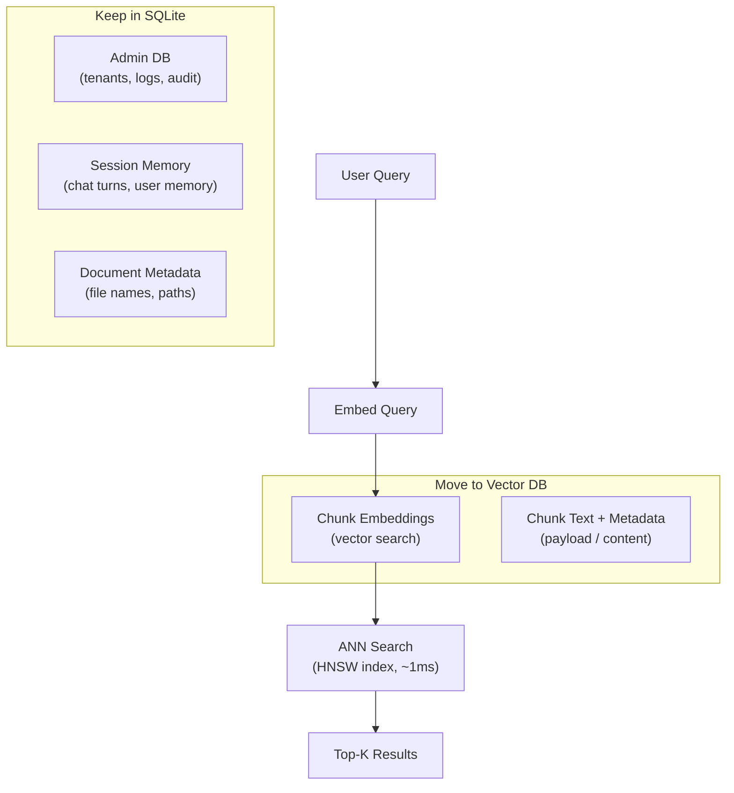

# Database Analysis: SQLite vs Vector Databases for TenBit RAG

## Current Architecture

> [!IMPORTANT]
> You are correct — the entire system runs on **SQLite** for everything: admin data, document storage, chunk embeddings, session memory, and audit logs.

### What SQLite Stores

| Database File | What It Stores | Module |
|---|---|---|
| `.rbs_rag/admin.db` | Tenants, system logs, audit trail | [admin_db.py](file:///c:/Root/Projects/TenBit/RAG/src/rbs_rag/web/admin_db.py) |
| `.rbs_rag/tenants/{id}/rag.db` | Documents, chunks + embeddings, session turns, user memory | [store.py](file:///c:/Root/Projects/TenBit/RAG/src/rbs_rag/store.py) |

### How Vector Search Currently Works

The critical performance bottleneck is in [retrieval.py](file:///c:/Root/Projects/TenBit/RAG/src/rbs_rag/retrieval.py). Here's the current flow:


> [!CAUTION]
> **The #1 problem: There is NO vector index.** Every search loads ALL chunks from SQLite into Python memory, then computes cosine similarity one-by-one in a Python `for` loop. This is an **O(n) brute-force scan** with no indexing, no SIMD, no approximate nearest neighbor (ANN) optimization.

### Current Code Evidence

From [retrieval.py:33](file:///c:/Root/Projects/TenBit/RAG/src/rbs_rag/retrieval.py#L33):
```python
# Loads EVERY chunk into memory every single query
chunks = self.store.list_chunks(self.tenant_id, knowledge_base_id, filters)
```

From [retrieval.py:54](file:///c:/Root/Projects/TenBit/RAG/src/rbs_rag/retrieval.py#L54):
```python
# Pure Python cosine similarity — no vectorization, no SIMD
dense_scores = {chunk.chunk_id: cosine_similarity(query_embedding, chunk.embedding)
                for chunk in chunks}
```

From [store.py:50](file:///c:/Root/Projects/TenBit/RAG/src/rbs_rag/store.py#L50):
```python
# Embeddings stored as JSON text: "[0.123, -0.456, ...]"
embedding_json TEXT NOT NULL
```

### Scaling Characteristics (Current System)

| Chunks in DB | Search Behavior | Estimated Latency |
|---|---|---|
| 100 | Brute-force OK | ~50ms |
| 1,000 | Noticeable | ~200-400ms |
| 10,000 | Slow | ~2-5 seconds |
| 100,000 | Unusable | ~30-60+ seconds |
| 1,000,000 | Crashes (OOM) | ☠️ |

---

## Should You Switch to a Vector Database?

### Short Answer: **It depends on your scale.**

For **≤ 5,000 chunks per tenant** (roughly 50-100 documents of moderate size), SQLite is actually fine *if* we add a proper in-memory vector index (like a numpy-accelerated brute-force or a local HNSW index). You don't necessarily need a separate vector database server.

For **> 10,000 chunks per tenant** or **multi-tenant production** with concurrent users, a dedicated vector database becomes important.

---

## Open-Source Vector Database Comparison

| Feature | Qdrant | ChromaDB | Milvus | Weaviate |
|---|---|---|---|---|
| **License** | Apache 2.0 | Apache 2.0 | Apache 2.0 | BSD-3 |
| **Index Algorithm** | HNSW (optimized) | HNSW (hnswlib) | IVF-FLAT, HNSW, DiskANN | HNSW |
| **Runs Embedded (in-process)** | ❌ (requires server) | ✅ Yes! | ❌ (requires server + etcd + MinIO) | ❌ (requires server) |
| **Setup Complexity** | Low (single binary or Docker) | **Very Low** (pip install) | **High** (3 services) | Medium (Docker) |
| **Hybrid Search (Vector + BM25)** | ✅ Built-in (Sparse + Dense) | ❌ (vector only) | ✅ (plugin-based) | ✅ Built-in |
| **Multi-tenancy** | ✅ (Collections per tenant) | ✅ (Collections) | ✅ (Partitions) | ✅ (Classes/tenants) |
| **Filtering/Metadata** | ✅ Rich payload filtering | ✅ Basic where clause | ✅ Scalar filtering | ✅ GraphQL-style |
| **Python Client** | ✅ `qdrant-client` | ✅ `chromadb` | ✅ `pymilvus` | ✅ `weaviate-client` |
| **Performance @ 1M vectors** | ⚡ Excellent | 🟡 Moderate | ⚡ Excellent | ⚡ Good |
| **Memory Footprint** | Medium (~200MB) | **Low** (~50MB embedded) | High (~1GB+ with deps) | Medium (~300MB) |
| **On-disk / Quantization** | ✅ (Product Quant, Scalar Quant) | ❌ Limited | ✅ Extensive | ✅ (PQ, BQ) |
| **Best For** | Production RAG systems | Prototyping & small-medium RAG | Massive-scale enterprise | Knowledge graph + RAG |

---

## My Recommendation

> [!TIP]
> **For your current project stage and architecture, I recommend one of two paths:**

### Option A: ChromaDB (Easiest Migration, Zero Infrastructure)

**Best if:** You want the simplest possible migration with zero ops overhead.

- Runs **embedded** inside your Python process (like SQLite today!)
- `pip install chromadb` — no Docker, no servers
- Drop-in replacement for the vector search part of `store.py`
- Keeps SQLite for admin/session/metadata (what it's good at)
- Handles ~500K vectors comfortably on a single machine
- ⚠️ No native hybrid search (BM25 stays in Python — but we already have that)

### Option B: Qdrant (Best Production Choice)

**Best if:** You want production-grade performance and built-in hybrid search.

- **Native hybrid search** (sparse + dense vectors) — can replace both cosine similarity AND BM25
- Single binary or Docker container — simple deployment
- Rich metadata filtering per tenant
- Excellent at 1M+ vectors
- ⚠️ Requires running a separate server process (but very lightweight)

### Option C: Keep SQLite + Add a Fast Vector Index (No New Dependencies)

**Best if:** You want zero new dependencies and your scale stays under ~10K chunks.

- Add `numpy` for vectorized cosine similarity (10-50x faster than pure Python loops)
- Or add `hnswlib` (~150KB library) for approximate nearest neighbor search
- Keep everything in SQLite, just build an in-memory HNSW index on startup
- ⚠️ Not suitable for very large scale

### NOT Recommended

- **Milvus**: Requires 3 separate services (etcd, MinIO, Milvus). Way too complex for your project.
- **Pinecone**: Paid/managed service, not open-source.
- **Weaviate**: Good but heavier than Qdrant with no significant advantage for your use case.

---

## Architecture After Migration

Regardless of which option you choose, the architecture would look like:



---

## Open Questions for You

1. **What is your expected scale?** How many documents per tenant, and how many tenants do you expect in production? This determines whether ChromaDB (simple) or Qdrant (robust) is the right call.

2. **Do you want the vector DB to run embedded (in-process like SQLite) or as a separate service?** ChromaDB can run embedded; Qdrant requires a server.

3. **Should I proceed with the migration now, or do you want to address this after the current UI/cloud-sync polish is complete?**
