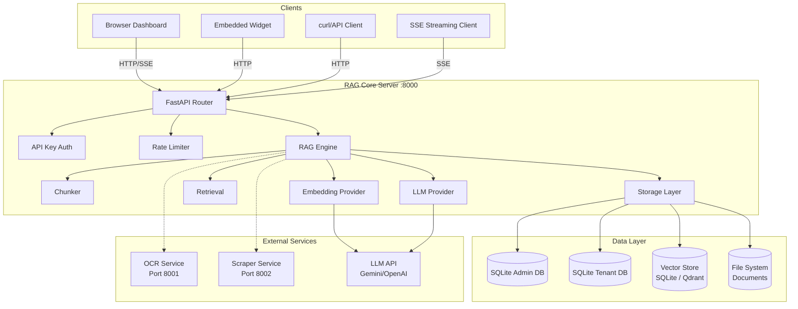
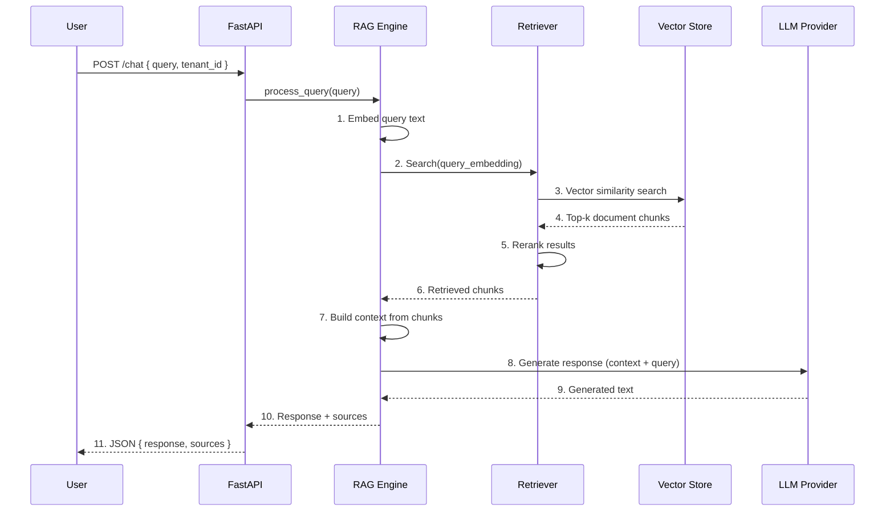
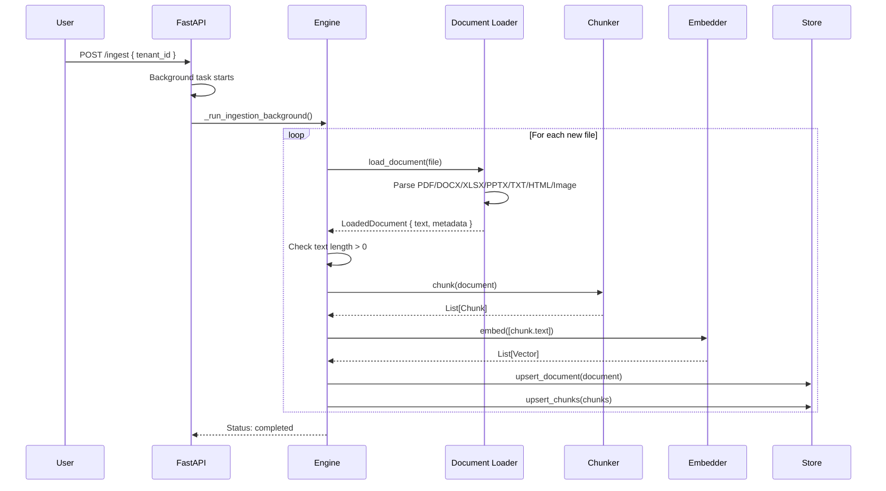
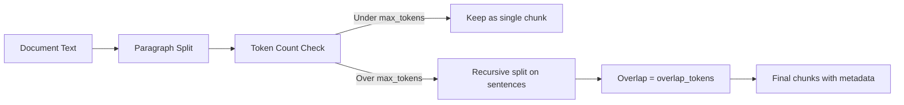
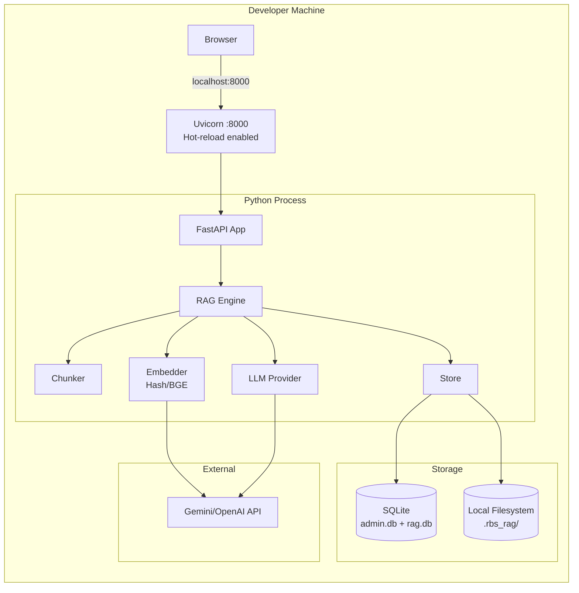
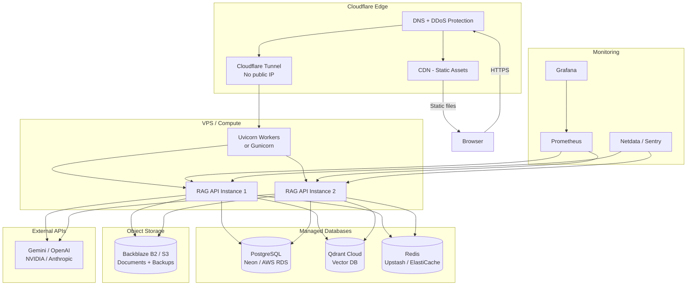
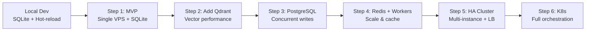
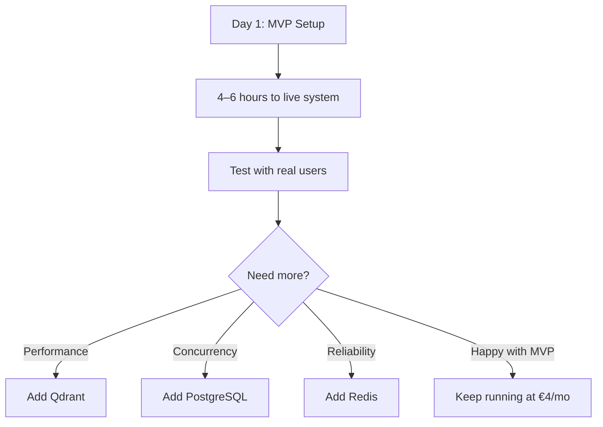

# TenBit RAG Platform — Complete Project Documentation

---

## Table of Contents

1. [Project Overview](#1-project-overview)
2. [Technology Stack](#2-technology-stack)
3. [System Architecture](#3-system-architecture)
4. [Directory Structure](#4-directory-structure)
5. [Core Components](#5-core-components)
6. [Data Flow](#6-data-flow)
7. [Local Development Setup](#7-local-development-setup)
8. [Local Architecture](#8-local-architecture)
9. [Cloud Architecture (Proposed)](#9-cloud-architecture-proposed)
10. [API Reference](#10-api-reference)
11. [Deployment Recommendations](#11-deployment-recommendations)
12. [Design Decisions](#12-design-decisions)

---

## 1. Project Overview

### What Is TenBit RAG?

TenBit RAG is an **enterprise-grade, multi-tenant Retrieval-Augmented Generation (RAG) platform** that allows organizations to upload documents, extract text, chunk them semantically, embed them into a vector index, and query them using large language models (LLMs). It includes integrated OCR for scanned documents, web scraping capabilities, and a full admin dashboard.

### What It Is NOT

- **Not a Node.js application.** The entire backend is Python 3.10+ using FastAPI. There is no Node.js runtime anywhere in the stack. The frontend is a vanilla HTML/JavaScript SPA served as static files — there is no React build pipeline, no webpack, no npm. Converting to Node.js would require rewriting all 44+ Python source files, which is a months-long engineering effort with zero functional benefit.

- **Not a desktop application.** It runs as a web server and is accessed via browser.

- **Not a SaaS.** Currently it's self-hosted software. Multi-tenancy exists but there is no billing, no user registration portal, and no automated provisioning.

### Current Status

| Aspect | Status |
|--------|--------|
| Core RAG engine | ✅ Production-ready |
| Multi-tenant admin | ✅ Implemented |
| Document upload & ingestion | ✅ Working |
| OCR (Mistral + Paddle) | ✅ Integrated |
| Web scraping | ✅ Integrated |
| SQLite storage | ✅ Working |
| Qdrant vector DB | ⚠️ Wrapper exists, not yet wired |
| PostgreSQL support | ❌ Planned |
| Docker deployment | ❌ No Dockerfile exists |
| Test coverage | ⚠️ Partial |
| CI/CD | ❌ None |

---

## 2. Technology Stack

### Backend

| Layer | Technology | Version | Purpose |
|-------|-----------|---------|---------|
| Language | Python | >= 3.10 | Application runtime |
| Web Framework | FastAPI | >= 0.115.0 | REST API, SSE streaming, OpenAPI docs |
| ASGI Server | Uvicorn | >= 0.30.0 | HTTP server with hot-reload |
| Validation | Pydantic | >= 2.10.0 | Request/response models |
| LLM Integration | Custom provider layer | — | Gemini, OpenAI, Anthropic, NVIDIA |
| Embeddings | Hash/FastEmbed/BGE-M3 | — | Text-to-vector |
| Vector Store | SQLite (current) / Qdrant (planned) | — | Similarity search |
| Document DB | SQLite / SQLite via sqlite-utils | — | Document metadata |
| OCR | Mistral OCR + PaddleOCR | — | Scanned document text extraction |
| Scraping | BeautifulSoup + Playwright + Selenium | — | Web content extraction |

### Frontend

| Layer | Technology | Purpose |
|-------|-----------|---------|
| UI Framework | None (vanilla HTML + CSS + JS) | Admin dashboard |
| Widget | Embeddable chat widget | External integration |
| API Client | Fetch API | Communication with backend |

### Infrastructure (Current Dev Setup)

| Component | Detail |
|-----------|--------|
| Database | SQLite (file: `.rbs_rag/rag.db`) |
| Vector Search | SQLite (O(n) brute force) |
| Caching | In-memory (Python dict) |
| Session Store | In-memory |
| File Storage | Local filesystem (`documents/`) |
| Configuration | JSON file (`.rbs_rag/config.json`) |
| Logging | Structured JSON logging to stdout |

### External Dependencies

```
Required:
  fastapi, uvicorn, pydantic, pydantic-settings,
  python-multipart, sqlite-utils, httpx,
  python-json-logger, pillow, numpy

Optional (recommended for full functionality):
  pdf:     pypdf, pymupdf
  excel:   openpyxl, xlrd
  pptx:    python-pptx
  ml:      fastembed, sentence-transformers, qdrant-client
  ocr:     opencv-python-headless, paddleocr, onnxruntime
  scraper: beautifulsoup4, cloudscraper, playwright, selenium,
           pdfminer.six, charset-normalizer
```

---

## 3. System Architecture

### 3.1 High-Level Architecture



### 3.2 Request Flow (Query)



### 3.3 Request Flow (Ingestion)



---

## 4. Directory Structure

```
tenbit-rag/
├── src/
│   └── rbs_rag/                          # Main Python package
│       ├── __init__.py
│       ├── __main__.py                   # CLI entry: `python -m rbs_rag`
│       ├── web_run.py                    # Server entry: `python -m rbs_rag.web_run`
│       ├── cli.py                        # CLI commands
│       ├── config.py                     # Configuration system
│       ├── chunking.py                   # Hierarchical + semantic chunking
│       ├── cloud_sync.py                 # Google Drive / OneDrive sync
│       ├── document_loaders.py           # All document parsers
│       ├── embeddings.py                 # Embedding providers
│       ├── engine.py                     # Core RAG engine
│       ├── llm.py                        # LLM providers
│       ├── models.py                     # Pydantic data models
│       ├── retrieval.py                  # Hybrid search
│       ├── store.py                      # SQLite storage layer
│       ├── text.py                       # Text utilities
│       ├── validation.py                 # Self-RAG validation
│       ├── vector_store.py               # Qdrant wrapper (planned)
│       ├── reranking.py                  # Result reranking
│       │
│       ├── web/                          # Web server
│       │   ├── __init__.py
│       │   ├── server.py                 # FastAPI app (998 lines)
│       │   ├── admin_db.py               # Multi-tenant admin DB
│       │   ├── web_run.py                # Web runner alias
│       │   └── static/                   # Frontend SPA
│       │       ├── index.html            # Main dashboard
│       │       └── widget.html           # Embeddable widget
│       │
│       ├── ocr/                          # OCR engine
│       │   ├── service.py
│       │   ├── engine.py
│       │   └── engines/
│       │       ├── base.py
│       │       ├── mistral_engine.py
│       │       ├── paddle_engine.py
│       │       └── orchestrator.py
│       │
│       ├── pdf/                          # PDF processing
│       │   └── pipeline.py
│       │
│       ├── preprocessing/                # Image preprocessing
│       │   └── preprocessor.py
│       │
│       ├── scraper/                      # Web scraping
│       │   ├── config.py
│       │   ├── core/engine.py
│       │   ├── fetcher/http_fetcher.py
│       │   ├── parsers/html_parser.py
│       │   ├── extractors/readability.py
│       │   └── storage/
│       │
│       ├── services/                     # Microservice clients
│       │   ├── ocr_service.py
│       │   └── scraper_service.py
│       │
│       ├── schemas/ocr.py                # Pydantic schemas
│       ├── table_detection/
│       └── utils/logger.py
│
├── tests/                                # Test suite (partial)
├── pyproject.toml                        # Project metadata + dependencies
├── .env.example                          # Environment template
├── hosting-analysis/                     # Deployment documentation (NEW)
│   ├── README.md
│   ├── PROJECT_DOCUMENTATION.md          # ← This file
│   ├── 01-docker-compose-deployment.md
│   ├── 02-vps-baremetal-deployment.md
│   ├── 03-cloud-managed-platforms.md
│   ├── 04-kubernetes-k3s-deployment.md
│   ├── 05-hybrid-distributed-deployment.md
│   └── 06-mvp-minimum-production.md
│
├── scraper-service-main/                 # External scraper microservice
├── ocr-service-main/                     # External OCR microservice
│
└── .rbs_rag/                             # Runtime data (gitignored)
    ├── config.json
    ├── admin.db
    └── tenants/
        ├── tenant-a/documents/
        └── tenant-b/documents/
```

---

## 5. Core Components

### 5.1 `engine.py` — RAG Engine

The central orchestrator. It ties together chunking, embedding, retrieval, and LLM generation.

```
RagEngine
├── .config          → AppConfig (all sub-configs)
├── .chunker          → Chunker (text → chunks)
├── .embedding_provider → EmbeddingProvider (text → vector)
├── .retriever        → Retriever (vector → relevant chunks)
├── .store            → Store (documents + chunks persistence)
├── .llm_provider     → LLMProvider (context + query → answer)
│
├── initialize()      → Loads vector store, prepares indices
├── add_chunks()      → Ingest chunks into store
├── search()          → Query → chunks + scores
├── generate()        → Query + chunks → LLM response
├── process_query()   → search() + generate() combined
└── stream_query()    → SSE streaming version of process_query()
```

### 5.2 `document_loaders.py` — Document Parsing

Handles all file types with a unified `load_document()` interface. Returns a `LoadedDocument` with text + metadata.

| File Type | Method | Library | Status |
|-----------|--------|---------|--------|
| .txt, .md, .markdown | `path.read_text()` | Built-in | ✅ |
| .html, .htm | HTML tag stripping | `html.parser` | ✅ |
| .docx | XML extraction from ZIP | `xml.etree.ElementTree` | ✅ |
| .pdf | Text extraction + OCR fallback | `pypdf` | ✅ |
| .xlsx | Cell extraction | `openpyxl` | ✅ |
| .xls | Cell extraction | `xlrd` | ✅ |
| .pptx, .ppt | Slide text extraction | `python-pptx` | ✅ |
| .csv | Row/column extraction | `csv` (built-in) | ✅ |
| .png, .jpg, .jpeg, .tiff, .bmp, .webp | OCR text extraction | PaddleOCR | ✅ |

**Supported extensions:** `.txt`, `.md`, `.markdown`, `.html`, `.htm`, `.docx`, `.pdf`, `.png`, `.jpg`, `.jpeg`, `.tiff`, `.bmp`, `.webp`, `.xlsx`, `.xls`, `.pptx`, `.ppt`, `.csv`

### 5.3 `chunking.py` — Hierarchical Chunking



### 5.4 `retrieval.py` — Hybrid Search

Combines dense vector similarity with sparse keyword matching (BM25-style):

```
score = (dense_weight × cosine_similarity) + (sparse_weight × keyword_overlap)

Default weights: dense=0.55, sparse=0.45
Top-k: 20 → Rerank → Final context: 5
```

### 5.5 `server.py` — FastAPI Application

The web server at 998 lines contains all REST endpoints, middleware, and the admin dashboard. Key sections:

| Lines | Content |
|-------|---------|
| 1–45 | Imports, globals, constants |
| 48–97 | Lifespan, middleware, rate limiter |
| 99–220 | Pydantic models, helper functions |
| 220–345 | Ingestion pipeline (`_run_ingestion_background`) |
| 346–500 | Tenant CRUD, document listing |
| 500–700 | Chat, search, streaming endpoints |
| 700–800 | Cloud sync, admin dashboard |
| 800–900 | Static files, health check |
| 900–998 | CLI handler, main entry |

---

## 6. Data Flow

### Query Path

```
User Request
    │
    ▼
FastAPI Router ──► API Key Auth ──► Rate Limiter
    │
    ▼
RagEngine.process_query(query, tenant_id)
    │
    ├─► 1. Embedder.embed(query) → query_vector
    │
    ├─► 2. Retriever.search(query_vector, top_k=20)
    │       ├─► VectorStore.similarity_search()
    │       └─► Reranker.rerank(chunks) → top 5
    │
    ├─► 3. Build context from reranked chunks
    │
    ├─► 4. LLMProvider.generate(prompt + context)
    │       └─► External LLM API (Gemini/OpenAI/etc.)
    │
    └─► 5. Return { response, sources, chunks }
```

### Ingestion Path

```
Upload File
    │
    ▼
Save to /tenants/{tenant_id}/documents/{file}
    │
    ▼
Background Task:
    For each uningested file:
    │
    ├─► load_document(file)  → LoadedDocument
    │       ├─► Parse by extension
    │       └─► OCR if image/scanned PDF
    │
    ├─► chunker.chunk(document) → List[Chunk]
    │
    ├─► embedder.embed([texts]) → List[Vector]
    │
    └─► store.upsert_document() + store.upsert_chunks()
```

---

## 7. Local Development Setup

### Prerequisites

- Python 3.10 or higher
- Git
- (Optional) Qdrant installed locally for vector search
- (Optional) Tesseract or PaddleOCR for OCR

### Installation

```bash
# 1. Clone the repository
git clone https://github.com/your-org/tenbit-rag.git
cd tenbit-rag

# 2. Create virtual environment
python -m venv .venv
source .venv/bin/activate   # Linux/Mac
.venv\Scripts\activate       # Windows

# 3. Install with all extras
pip install -e .[all]

# 4. Create configuration
mkdir -p .rbs_rag

# 5. Configure LLM API key
# Create .env file:
echo 'RAG_LLM_API_KEY=your-gemini-or-openai-key' > .env

# 6. Initialize
python -m rbs_rag init

# 7. Start server
python -m rbs_rag.web_run

# 8. Open browser
# Admin dashboard: http://localhost:8000
# API docs:        http://localhost:8000/docs
```

### Running with Docker (Manual, No Dockerfile Yet)

Currently there is no Dockerfile in the repository. See deployment plan 01 for design. For local testing without containers:

```bash
# Start Qdrant (if using vector search)
docker run -d -p 6333:6333 -p 6334:6334 qdrant/qdrant

# Start the app (native)
python -m rbs_rag.web_run
```

---

## 8. Local Architecture

When running on a developer's machine (the current state), the architecture is intentionally simple:



**Characteristics of the Local Architecture:**
- **Single process.** Everything runs inside one Python process. The uvicorn reloader automatically restarts on file changes.
- **SQLite for everything.** Documents, chunks, vectors, admin data — all in SQLite files under `.rbs_rag/`.
- **In-memory caching.** No Redis. Sessions and embeddings cache are Python dicts.
- **No containerization.** The app runs directly on the host OS with Python.
- **Port 8000.** Default development port, accessible at `http://localhost:8000`.
- **Hot-reload.** File changes auto-restart the server (~1s restart time).
- **API key auth.** Each tenant has an API key sent via `X-API-Key` header.
- **Rate limiting.** In-memory, default 60 requests/minute per client IP.

**Limitations of the Local Architecture:**
- SQLite does not scale beyond ~10 concurrent writes (use PostgreSQL in production)
- Vector search is O(n) brute force (use Qdrant for production)
- In-memory cache resets on restart (use Redis for production)
- Single process = single point of failure (use multiple workers + load balancer in production)
- No SSL termination (use Nginx or Cloudflare Tunnel in production)
- No log persistence beyond stdout (use file logging or systemd journal in production)

---

## 9. Cloud Architecture (Proposed)

For production deployment, the proposed architecture separates concerns into distinct services, each independently scalable:



**Key Differences from Local Architecture:**

| Aspect | Local | Cloud / Production |
|--------|-------|-------------------|
| Web Server | Single uvicorn process | Multiple workers (4–8) + reverse proxy |
| Database | SQLite | PostgreSQL (with connection pooling) |
| Vector Search | SQLite brute force | Qdrant (HNSW index) |
| Cache | In-memory dict | Redis (persistent, shared) |
| File Storage | Local filesystem | S3-compatible object store |
| SSL | None (localhost) | Auto SSL via Cloudflare / Certbot |
| Rate Limiting | In-memory | Redis-backed distributed limiter |
| Monitoring | stdout logs | Prometheus + Grafana + structured logging |
| Backups | Manual copy | Automated daily + off-site |
| High Availability | None | 2+ instances, load-balanced |
| Deployment | `python -m web_run` | CI/CD pipeline (GitHub Actions) |

### Migration Path: Local → Cloud



Each step is optional and incremental. You can stop at any level that meets your needs.

---

## 10. API Reference

### Authentication

All API requests (except health check) require an API key header:

```
X-API-Key: rbs_rag_sk_xxxxxxxxxxxxxxxxxxxxxxxxxxxxxxxx
```

### Endpoints Summary

| Method | Path | Description |
|--------|------|-------------|
| `GET` | `/health` | Health check (no auth) |
| `GET` | `/docs` | Swagger UI documentation |
| `POST` | `/api/v1/tenants` | Create a new tenant |
| `GET` | `/api/v1/tenants` | List all tenants |
| `GET` | `/api/v1/tenants/{id}` | Get tenant details |
| `PATCH` | `/api/v1/tenants/{id}` | Update tenant configuration |
| `DELETE` | `/api/v1/tenants/{id}` | Delete a tenant |
| `POST` | `/api/v1/tenants/{id}/documents` | Upload a document |
| `GET` | `/api/v1/tenants/{id}/documents` | List documents |
| `DELETE` | `/api/v1/tenants/{id}/documents/{doc_id}` | Delete a document |
| `POST` | `/api/v1/tenants/{id}/ingest` | Trigger document ingestion |
| `GET` | `/api/v1/tenants/{id}/ingest/status` | Ingestion progress & logs |
| `POST` | `/api/v1/tenants/{id}/chat` | Ask a question (with sources) |
| `GET` | `/api/v1/tenants/{id}/chat/stream` | SSE streaming chat |
| `POST` | `/api/v1/tenants/{id}/search` | Search without LLM generation |
| `POST` | `/api/v1/tenants/{id}/cloud-sync` | Sync Google Drive / OneDrive |
| `GET` | `/widget` | Embeddable widget HTML |

### Example: Chat Request

```bash
curl -X POST https://rag.yourdomain.com/api/v1/tenants/my-tenant/chat \
  -H "Content-Type: application/json" \
  -H "X-API-Key: rbs_rag_sk_xxxx" \
  -d '{
    "query": "What is the tax rate for e-commerce in the UAE?",
    "top_k": 10,
    "stream": false
  }'
```

Response:

```json
{
  "response": "According to the documents, the VAT rate for e-commerce in the UAE is 5%...",
  "sources": [
    {
      "document_id": "abc123",
      "document_name": "VAT-Guide-2024.pdf",
      "score": 0.92,
      "chunk_text": "...VAT is applicable at 5% on all taxable supplies including e-commerce..."
    }
  ],
  "token_usage": {
    "prompt_tokens": 1245,
    "completion_tokens": 312,
    "total_tokens": 1557
  }
}
```

### Example: SSE Streaming Chat

```bash
curl -N -X POST https://rag.yourdomain.com/api/v1/tenants/my-tenant/chat \
  -H "Content-Type: application/json" \
  -H "X-API-Key: rbs_rag_sk_xxxx" \
  -d '{
    "query": "Summarize the document set",
    "stream": true
  }'
```

Response is a Server-Sent Events stream:

```
event: chunk
data: {"text": "Based on the", "done": false}

event: chunk
data: {"text": " uploaded documents,", "done": false}

event: done
data: {"text": " the main topics are...", "done": true, "sources": [...]}
```

---

## 11. Deployment Recommendations

This section evaluates all six deployment plans from the `hosting-analysis/` directory and provides a structured recommendation.

### Decision Matrix

| Criteria | Docker (1) | VPS (2) | Cloud (3) | K3s (4) | Hybrid (5) | MVP (6) |
|----------|-----------|---------|-----------|---------|------------|---------|
| Monthly Cost | €10–30 | €5–25 | €5–40 | €40–150 | **€5–50** | **€4** |
| Setup Time | 2–4 days | 3–5 days | 1–2 days | 5–10 days | 1–2 days | **4–6 hrs** |
| DevOps Skill | Medium | High | Low | Very High | Low | Low |
| Scalability | Medium | Low | Medium | High | High | Low |
| HA / Uptime | Low | Low | Medium | High | High | None |
| Flexibility | Medium | High | Low | Very High | Medium | Low |
| Portability | High | Low | Low | Very High | Medium | Low |
| Learning Curve | Medium | Medium | Low | Very High | Low | **Very Low** |

### Recommendation by Use Case

#### If you are evaluating the software (first 30 days)

**→ Choose Document 6: MVP Minimum Production**



**Why:** At €4/mo you get a production-ready system in half a day. Cloudflare Tunnel handles SSL and security for free. If the system meets your needs, you never need to upgrade. If it doesn't, you've invested almost nothing.

---

#### If you need reliable production (5–50 tenants)

**→ Choose Document 5: Hybrid Distributed Deployment**

**Why:** This is the **sweet spot** of the entire analysis. You get:
- **Managed PostgreSQL** (Neon free tier or $19/mo) — auto-backups, 99.95% uptime
- **Managed Qdrant** (free or $25/mo) — high-performance vector search, zero ops
- **Managed Redis** (Upstash free or $5/mo) — persistent caching, session storage
- **Tiny VPS** at €4–13/mo running only the API behind Cloudflare Tunnel
- **Total: ~€5–50/mo** depending on scale

The VPS itself becomes "disposable" — if it crashes, spin up a new one in 10 minutes. All persistent data lives in managed services with their own SLAs.

**Trade-off:** Slightly higher latency (API → cloud DB over network) vs. everything-on-one-box. Mitigate by choosing cloud DB regions close to the VPS.

---

#### If you have a DevOps team and need maximum control

**→ Choose Document 1: Docker Compose Deployment**

**Why:** Docker Compose gives you a repeatable, portable deployment with a single command. It's the standard approach for teams that already use Docker. The elimination of environment inconsistencies and the ability to pin versions makes it ideal for teams.

**Comparison to Document 5 (Hybrid):**
- **Cheaper at low scale:** Hetzner CX32 + all services in Docker = ~€13/mo vs. Hybrid's ~€5–50/mo
- **More operational work:** You manage PostgreSQL, Qdrant, and Redis yourself
- **Single point of failure:** If the VPS goes down, everything goes down (vs. Hybrid where managed DBs survive)

---

#### If you have zero DevOps resources

**→ Choose Document 3: Cloud Managed Platforms**

**Why:** Railway, Render, and Fly.io handle server management entirely. You push to Git, they build and deploy. PostgreSQL and Redis are one-click adds. No SSH, no systemd, no Nginx configs.

**Trade-off:** 2–4× more expensive than a VPS at scale. Cold starts on free tiers. No custom Qdrant (use Qdrant Cloud separately).

---

#### If you need high availability and auto-scaling

**→ Choose Document 4: Kubernetes (K3s)**

**Why:** Self-healing pods, rolling updates, horizontal auto-scaling, and multi-node HA. Best for organizations already invested in Kubernetes.

**Trade-off:** Minimum €39/mo for 3 nodes. Requires a dedicated DevOps engineer. Overkill for < 50k queries/day.

---

#### If you need bare-metal performance or compliance

**→ Choose Document 2: VPS Bare-Metal**

**Why:** No Docker overhead, direct hardware access, full OS control. Best for compliance requirements (audit every package) or maximum CPU/memory efficiency. Choose this when your security/compliance team mandates no containerization.

**Trade-off:** Most manual maintenance. Every OS update, package conflict, and service failure is your problem to solve.

---

### Final Recommendation

```
Budget Conscious (< €10/mo)
    └── MVP (Doc 6) ⭐

Small Team, Quick Launch
    └── Hybrid (Doc 5) ⭐

DevOps Team, Standard Stack
    └── Docker Compose (Doc 1)

No DevOps, Just Code
    └── Cloud Managed (Doc 3)

High Availability Required
    └── Kubernetes (Doc 4)

We Don't Use Containers
    └── VPS Bare-Metal (Doc 2)
```

**The highest-recommended path for most organizations:**

```
Start:  MVP (Doc 6) — 4 hours, €4/mo
        ↓
Grow:   Hybrid (Doc 5) — add managed DBs incrementally, €5–50/mo
        ↓
Scale:  K3s (Doc 4) — full orchestration, €40–150/mo
```

This path lets you prove the product works at near-zero cost before investing in infrastructure, then scale each component independently as demand grows.

---

## 12. Design Decisions

### Why Python + FastAPI instead of Node.js / Go / Rust?

- **Ecosystem:** Python has the best NLP/ML libraries (sentence-transformers, PyTorch, ONNX, etc.). RAG is an ML-adjacent problem.
- **Developer velocity:** FastAPI is the fastest Python web framework, with auto-generated OpenAPI docs, Pydantic validation, and async support.
- **Team familiarity:** The existing codebase was written by Python developers.
- **No Node.js dependency:** The frontend is vanilla HTML/JS, not React. There is no build step, no npm, no webpack. The entire project requires only `pip install`.

**Cost of this decision:** Python is slower than Go/Rust for raw throughput. At high scale (10k+ req/s), you would need more instances. For the RAG use case, the bottleneck is always the LLM API call (500ms–5s), not Python overhead.

### Why SQLite instead of PostgreSQL (for now)?

- **Zero setup.** No Docker, no apt install, no database users. The database is a file.
- **Perfect for single-server deployments.** SQLite handles up to ~50 concurrent readers.
- **Easy backup.** Copy a single file.
- **Migration path exists.** The storage layer (`store.py`) uses SQLAlchemy-style patterns. Switching to PostgreSQL requires changing the connection string and running a migration script.

**When to switch:** When you have more than 5 concurrent write operations (multiple simultaneous document uploads/ingestions).

### Why in-memory rate limiting instead of Redis?

- **Simplicity.** No external dependency for the MVP.
- **Adequate for single-server.** Works correctly as long as there's only one server process.
- **Downgrade on multi-worker.** If you scale to multiple uvicorn workers, each has its own rate limiter — a user could do 60 req/min per worker. Fix this by switching to Redis-backed rate limiting (planned for production).

### Why no Dockerfile yet?

- **The project was built as a library first.** `pyproject.toml` defines a Python package, not a deployment artifact.
- **Dockerizing is packaging, not architecture.** The code doesn't need changes — it needs a Dockerfile and docker-compose.yml (which deployment document 01 provides).
- **Intentional choice.** Leaving Docker out of the initial development avoided the complexity of volume mounts, networking, and multi-stage builds during rapid iteration.

### Why Cloudflare Tunnel instead of opening ports?

- **No public IP needed.** The VPS makes outbound connections only. No firewall rules, no port forwarding.
- **Free SSL.** Cloudflare provisions and renews Let's Encrypt certificates automatically.
- **DDoS protection.** Cloudflare's free plan absorbs most attacks.
- **Performance.** Cloudflare's global Anycast network routes traffic to the nearest edge.
- **Simple setup.** One binary, one config file, one systemd service.

### Why vanilla HTML/JS instead of React?

- **Zero build step.** No webpack, no Babel, no npm install, no `node_modules`.
- **Single file deployment.** `index.html` is self-contained. No asset pipeline.
- **Sufficient for an admin dashboard.** The UI is primarily forms, tables, and chat. It doesn't need virtual DOM diffing.
- **Easy to embed.** `widget.html` can be included in any website with an `<iframe>`.
- **Future upgrade path.** A React frontend can be added as a separate project under `frontend/` without touching the backend.

### Why single-process instead of microservices (for now)?

- **Development speed.** A monorepo with a single Python process is faster to develop, debug, and deploy.
- **Low latency.** Function calls instead of HTTP calls between components.
- **Simpler deployment.** One service to monitor, one log stream to follow.
- **Microservices planned for scale.** As the system grows, the OCR and Scraper services (already designed as separate processes on ports 8001 and 8002) can be deployed independently.
